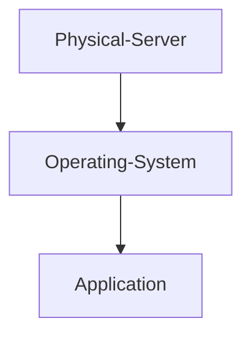
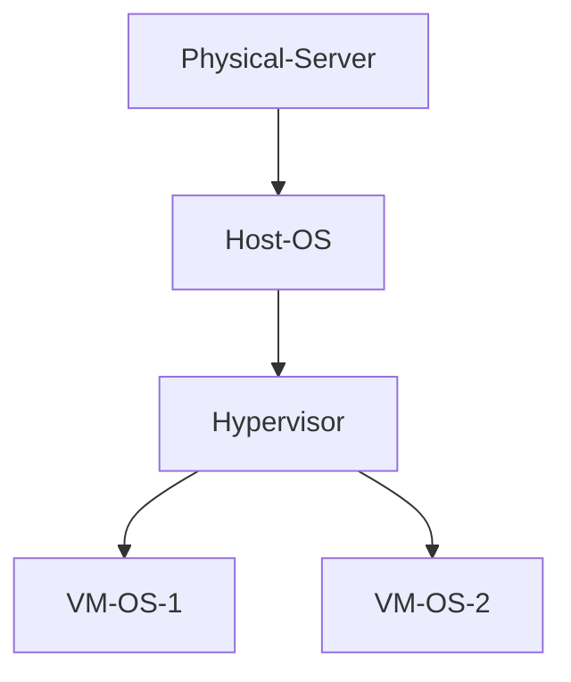
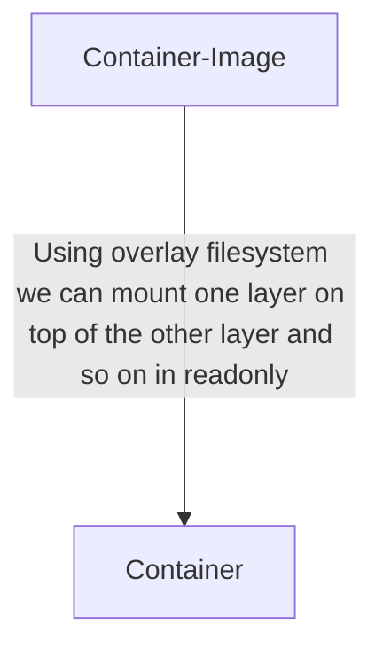

# Containers

## - Traditional




## - VM




## Containment

- Processes should behave as they are in a separate computer : **PID Namespace**

- Should have separate IP address and should not interfere with port usage of host : **Network Namespace**

- Separate users : **User Namespace**

- Filesystem shipped with the image should apply : **pivot_root**

- Resource limits should apply (control groups) : **cgroups**

- Should not be able to make critical changes (restricted syscalls) : **Seccompt-bpf**

_____________________________________________________________________________________________________________________________

## Namespace

- A Namespace wraps a global system resource in an abstraction that makes it appear to the processes within the Namespace that they have their own isolated instances of the global resource.

- Changes to the global resource are visible to other processes that are members of the Namespace but are invisible to other processes.
</br>


| Kernel Space (Local System)  | User Space (Global System) |
|-------------|:-------------:|
| Can see Kernel space as well as user space  | Can only see user space |

</br>
_____________________________________________________________________________________________________________________________

## Process ID Namespace

- Separate namespaces for all new spawned processes
- To list available namespaces

```
> lsns
```

### 1. Create a new Namespace

```
> unshare -h
> unshare --fork --pid --mount-proc bash
> ps -ef

[ --fork 		: spawn before launching]
[ --pid			: unshare PID namespace ]
[ --mount-proc	: mount process FileSystem first]
```

- Run a program with some namespaces unshared from the parent

### 2. Control Groups (cgroups)

- Linux kernel feature which allows processes to be organized into hierarchical groups with resource limitations and monitoring

- The kernels cgroup interface is provided through a pseudo-FileSystemstem called "cgroupfs"

- Resource tracking and limits are implemented in a set of pre-resource-type subsytem (memory, CPU etc.)

```
Checking cgroup
> ls /sys/fs/cgroup/

Look for memory dir
> ls /sys/fs/cgroup/memory/memory.limit_in_byte

Create cgroup
> cgcreate -g memory:test

Checking cgroup
> ls /sys/fs/cgroup/memory/test/  

Giving 512MB max RAM
> echo "536870912" > /sys/fs/cgroup/memory/test/memory.limit_in_bytes
	OR 
> cgset - memory.limit_in_bytes=536870912 test

Setting CPU Quota
> cgset -r cpu.shares=521 test

Apply this cgroup to a process (bash)
> cgexec -g memory:test bash 
```

- This means all the child processors spawned found the bash process, if they try to consume more than 512MB of RAM then these processes will be killed

### chroot

- Setting a new root dir (/dir will change)
+ chroot to the rescue 
- Interacts with binaries, libs of the Containers and their FileSystem 

```
chroot /mnt bash
```

**ISSUE :** This applies to a single process and dir above the root of the chroot are still technically accessible.

### 3. pivot_root

- Applies to the entire mount namespace
- Old root is unmounted

**Overlay Filesystem**

- All layers are mounted to create the final Filesystem

```
> mount -t overlay

/root/code.py 						--- layer 1
/bin/python3 /lib/python3/libs 		--- layer 2
/usr /bin /sbin /root ... 			--- layer 3
```



| Temp FileSystem  | user-space, read-write |
| ------------- | ------------- |
| /root/code.py  | Read-Only  |
| /bin/python3 /lib/python3/libs  | Read-Only  |
| /usr /bin /sbin /root ... | Read-Only |

### Docker Image Archive

```
> docker save image > image.tar 
> tar -xvf image.tar 
> tree
```

## What is Container

**Namespace + CGroup + Layer Images + Overlay Filesystem + Pivot_root**

```
> docker run <user-name>/webapp
> docker run nginx
> docker run ansible
> docker run httpd:latest
```

**OR** 

```
> vim docker-compose.yml
	|
	+-->	services:
			image: "nginx"
			orch:
				image: "ansible"
			web2:
				image: "httpd:latest"

OR With Ports 

> vim docker-compose.yml
	|
	+-->    version: "3.0"
			web1:
				image: "httpd"
				ports:
					- "80:80"
			web2:
				image: "nginx"
				ports:
					- "1000-2000:81"

> docker-compose up

> docker-compose ps
```

