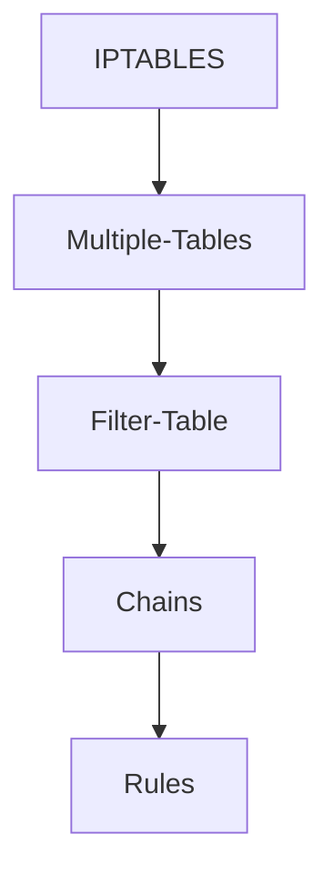

## Firewall

- A harware or sofware that allows autherized traffic and denies unautherized traffic

**Classification of firewall** </br>
	- Hardware eg. cisco, juniper </br>
	- Software eg. iptables for linux </br>

_______________________________________________

### Broad classification

**1. Packet Filtering** </br>
		- Firewall that checks Transport, Network, Data link and physical layer </br>
		- faster than Aplication proxy </br>

**2. Application Proxy** </br>
		- Firewall that checks Application to Physical layer </br>
		- Relatively slower as it needs more checks to perform </br>

____________________________________________________

## IPTABLES

- **IPTABLES** : *User space module*

- **NETFILTER** : *Kernel space module*

- By default there are 5 iptables

	  1. filter [By Default]
	  2. nat
	  3. raw
	  4. mangle
	  5. security



_____________________________________

# CHAINS

### 1. INPUT

- Controls the behavior of incoming traffic
- Everything that has not yet been caught will be **DROP**ed by the default policy on the INPUT chain.

### 2. OUTPUT

- Controls the behavior of Outgoing traffic
- Default policy should either be ACCEPT or DROP
- Reads the rules in a sequestial manner
- If the rule matches it will exit and will not fire the next rule

### 3. FORWARD

- Used for incoming connections that aren't really delivered locally
- Basically the packets are fowarded through the system and are not destined locally

### 4. PRE-ROUTING

- Alters the packets as they arrive i.e before routing
- Does Network Address Translation on packets before routing

### 5. POST-ROUTING

- Alters the packets as they leave i.e After routing
- Performs NAT on outgoing packets from interface

______________________________________________

## Filtering Terms and Expressions

**1. ACCEPT** </br>
	- *Accepts the packet and lets it through the firewall* </br>

**2. REJECT** </br>
	- *Rejects the request and sends an ack as well saying its rejected*

**3. DROP** </br>
	- *Drops the packet completely without any acknowledgement* </br>


```
#sudo which iptables				

#sudo iptables -L                 --- listing chains
#sudo iptables -L -v              --- lists chains with more details

#sudo iptables -P FORWARD DROP
[ -P to change the policy to either accept or DROP ]

#sudo iptables -P INPUT DROP

#sudo iptables -A INPUT -i lo -j ACCEPT
	[-A   Append or Add   ]
	[-i   Interface       ]
	[lo   Loopback address]
	[-j   Jump To         ]

#sudo iptables -L -v                               --- to check if the rules are applied or not

#iptables -A INPUT -m state --state ESTABLISHED -j ACCEPT
[-m   check if MATCHING MODULE]
[ append input with macthing module of state that is established then jump to accept ]

#iptables -A INPUT -p tcp --dport 22 -j ACCEPT
[-p   Protocol]
[--dport    Destination Port]
[ append input protocol tcp with destination port as 22 then jump to accept ]


#ss -ant
[ to check the ports ]

+---------------------+
| HOW TO DELETE RULES |
+---------------------+

#sudo iptables -L INPUT --line-numbers              --- to check the index of rules

#sudo iptables -D INPUT 5                           --- deletes the 5th index

#sudo iptables -F                                   --- Flushes all the rules

```
________________________________

## TO APPLY THE RULES ON BOOTING TIME

```
#sudo mkdir /etc/iptable

#sudo iptables-save > /etc/iptables/rules.v4
	[redirects the output to rules file which the system will look for at booting time]
	[this will not work as the shell will only read the first cmd as sudo]

#sudo sh -c "iptables-save > /etc/iptables/rules.v4"

#sudo apt-get install iptables-persistent

```

**PRE-ROUTING**	 :	*D-NAT*
**POST-ROUTING**   :	*S-NAT*

### PORT FORWARDING

```
#sudo iptables -t nat -L
[ shows NAT chains ]

#sudo iptables -t nat -A PREROUTING -p tcp --dport 8001 -j REDIRECT --to-port 80

```
